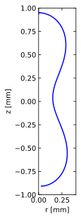

# Spinning drop profile calculator
This Python script numerically integrates the profile of a liquid drop spinning rapidly around an axis while levitating. The equilibrium shape is governed by the **Young-Laplace equation**, which balances two forces:
1.  **Capillary pressure:** due to surface tension ($\sigma$).
2.  **Centrifugal pressure:** due to rotation ($\omega$).

The form of the Young-Laplace equation follows the coordinate system described by Demirkır et al. (2024)[^1], but we substitute gravitational acceleration $g$ for centrifugal acceleration $\omega^2z$.

## Derivation of the ordinary differential equation for the profile shape 

The `spinning_drop_profile_solver` solves the ODE system using the Euler-step method. The key ODE governing the change in interface angle $\psi$ to the horizontal is derived from the Young-Laplace equation:

$$\sigma \left( \frac{1}{R_1} + \frac{1}{R_2} \right) = p_\text{in} - p_\text{out},$$

where $\sigma$ is the surface tension, $R_1$ and $R_2$ are the principal radii of curvature at a point on the interface, and $p_\text{in}$, $p_\text{out}$ are the pressures inside and outside the drop, respectively. Assume both fluid phases are in rotational equilibrium, with rotation rate $\omega$. Then the pressures gradient at distance $z$ from the rotation axis must balance the centripetal acceleration $\omega^2 z$:

$$p_\text{in}(z) = q_\text{in} + \frac{1}{2}\rho_\text{in} \omega^2 z^2,$$

$$p_\text{out}(z) = q_\text{out} + \frac{1}{2}\rho_\text{out} \omega^2 z^2,$$

Here $\rho_\text{in}$ and $\rho_\text{out}$ are the densities of the inner and outer fluids, $q_\text{in}$ and $q_\text{out}$ pressures of the inner and outer fluid at the axis ($z = 0$). Substituting into the Young-Laplace equation gives:

$$\sigma \left( \frac{1}{R_1} + \frac{1}{R_2} \right) = q_\text{in} - q_\text{out} + \frac{1}{2}(\rho_\text{out} - \rho_\text{in}) \omega^2 z^2.$$ 

Let $\Delta\rho \equiv \rho_\text{out} - \rho_\text{in}$ be the density difference, and divide through by the surface tension:

$$\frac{1}{R_1} + \frac{1}{R_2} = \frac{q_\text{in} - q_\text{out}}{\sigma} + \frac{\Delta\rho \omega^2 z^2}{2\sigma}.$$

To eliminate the pressure difference $q_\text{in} - q_\text{out}$, evaluate this equation at the tip of the drop, where $r=0,\quad z=z_\text{tip}$ and the interface is spherical, so $R_1 = R_2 = R_\text{tip}$:

$$\frac{2}{R_\text{tip}} = \frac{q_\text{in} - q_\text{out}}{\sigma} + \frac{\Delta\rho \omega^2 z_\text{tip}^2}{2\sigma}.$$

Subtracting this from the pressure-curvature relation gives:

$$\frac{1}{R_1} + \frac{1}{R_2} = \frac{2}{R_\text{tip}} + \frac{\Delta\rho \omega^2 (z^2 -z_\text{tip}^2) }{2\sigma}.$$

### Geometric formulation in axisymmetric coordinates

Assuming the drop is symmetric about the $z$ axis, which is perpendicular to the rotation axis, we describe the interface shape in terms of arc length $s$ from the tip, radial coordinate $r(s)$, axial coordinate $z(s)$, and the angle $\psi(s)$ between the interface tangent and the axis of rotation. The two principal curvatures are:

$$R_1 = \frac{ds}{d\psi},\quad R_2 = \frac{r}{\sin\psi}.$$

Substituting into the pressure-curvature relation yields the governing equation for the drop shape:

$$\frac{d\psi}{ds} + \frac{\sin\psi}{r} = \frac{2}{R_{\text{tip}}} + \frac{\Delta\rho \omega^2 (z^2 -z_\text{tip}^2)}{2\sigma}.$$

Using the rotational capillary length $\lambda = \left( \frac{\sigma}{\Delta\rho \omega^2} \right)^{1/3}$, this becomes:

$$\frac{d\psi}{ds} = \frac{2}{R_{\text{tip}}} + \frac{(z^2 -z_\text{tip}^2)}{2\lambda^3} - \frac{\sin(\psi)}{r}.$$

To avoid floating point underflow when numerically integrating the equation, we multiply by the **rotational capillary length**, so that each term is dimensionless:

$$\lambda\frac{d\psi}{ds} = \frac{2\lambda}{R_{\text{tip}}} + \frac{(z^2 -z_\text{tip}^2)}{2\lambda^2} - \frac{\lambda\sin(\psi)}{r}.$$

This equation governs the curvature of an axisymmetric interface under centrifugal forces, we solve it iteratively from the tip of the drop, where $\psi=0,$ $r=0,$ and $z=z_\text{tip}$. We wish to find the shape of a drop with its centre of mass on the rotation axis $z=0$, so we adjust $R_\text{tip} until we obtain a symmetrical profile.

### Variable definitions

- $s$ is the arc length along the drop interface, starting from the tip. This is the integration coordinate.
- $\psi$ is the interface angle (or angle of inclination). This is the angle the tangent to the drop profile makes with the axis of rotation. It starts at $\psi=0$ at the tip and approaches $\psi=\pi$ at the far pole (if the drop closes).
- $R_{\text{tip}}$ is the radius of curvature at the starting point (the tip of the drop). This value is the critical *shooting parameter* that must be adjusted to find drop with its centre of mass on axis.
- $z$ is the distance from the rotation axis.
- $r$ is the distance from polar axis of of the drop.

## Requirements
* Python 3.x
* `numpy`
* `matplotlib`

## How to run
Run the script from your terminal:
```bash
python spinning_drop.py
```

### Output files
The script generates two main output files in the `data/` directory:
1.  **`data/spin.txt`**: Raw non-dimensional data columns: `r`, `z`, `psi`, `dPsi/ds`, and `lambda`.
2.  **`data/spin.pdf`**: A PDF visualization of the calculated drop profile, showing the 2D cross-section in millimeters (mm).

## Example output
The figure below shows the calculated profile based on the default parameters ($\sigma = 72 \text{ mN/m}$, $\Delta\rho = 1000 \text{ kg/m}^3$, $\omega = 759 \text{ rad/s}$):



## References
[^1]: Demirkır, Ç., Wood, J. A., Lohse, D., & Krug, D. (2024). Life beyond Fritz: On the Detachment of Electrolytic Bubbles. *Langmuir*, 40(39), 20474–20484. [https://doi.org/10.1021/acs.langmuir.4c01963](https://doi.org/10.1021/acs.langmuir.4c01963)
